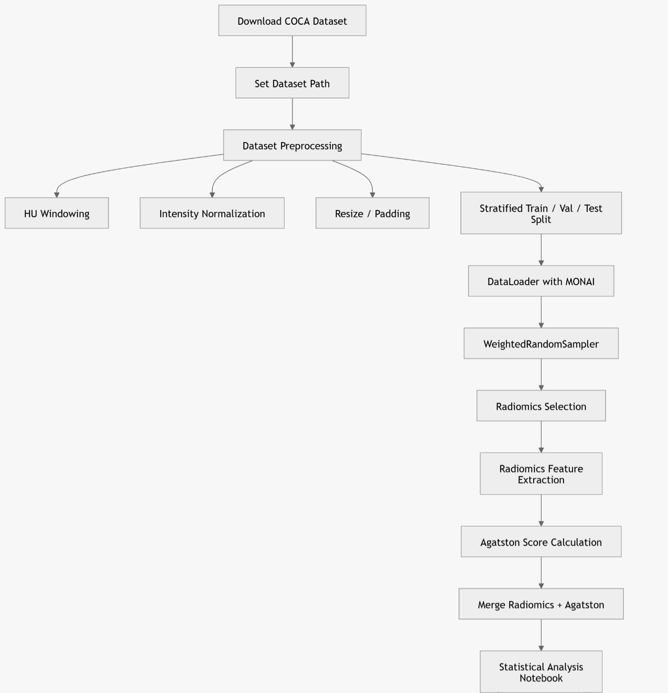

# COCA Dataset Preprocessing & Radiomics Pipeline

## Task Overview

This evaluation task implements a complete preprocessing and radiomics analysis
pipeline for the **COCA (Coronary Calcium) dataset**.

The goal is to build a **modular and reproducible pipeline** that
prepares cardiac CT scans for downstream analysis, including **radiomics
feature extraction** and **Agatston score analysis**.

The pipeline includes:

-   Dataset preprocessing tailored for cardiac CT imaging
-   HU windowing and intensity normalization
-   Stratified dataset splitting
-   Efficient data loading with MONAI
-   Handling class imbalance with WeightedRandomSampler
-   Radiomics feature extraction
-   Agatston score computation
-   Statistical analysis of radiomics features

The project structure is designed to ensure **modularity,
reproducibility, and flexibility**

------------------------------------------------------------------------

## Pipeline Overview

The following diagram summarizes the full preprocessing and radiomics pipeline.



------------------------------------------------------------------------

# Justification

In this task, a comprehensive **preprocessing and data loading
pipeline** was implemented for the COCA dataset to ensure
**reproducibility, efficiency, and compatibility with downstream
tasks**.

The preprocessing stage includes **Hounsfield Unit (HU) windowing**
tailored for cardiac CT, followed by **intensity scaling** to normalize
image values between **0 and 1**. Spatial consistency across scans is
ensured using MONAI's `ResizeWithPadOrCropd`, which standardizes image
dimensions while preserving anatomical information.

Optional **data augmentation** using affine transformations (random
rotation and translation) is applied to the training set to improve
**model generalization**.

To address **dataset imbalance**, a **stratified train/validation/test
split** is performed based on calcium presence. Additionally, a
**WeightedRandomSampler** is used during training to ensure balanced
sampling across classes.

Data loading is implemented using MONAI utilities, including
`list_data_collate`, allowing **efficient batching of 3D medical
images**.

The pipeline is modularized into separate scripts:

-   dataset.py
-   split.py
-   dataloader.py

Furthermore, dataset paths are configured through **environment
variables** to avoid hard-coded paths and ensure **portability across
systems**.

This design supports multiple downstream tasks including:

-   segmentation optimization
-   radiomics analysis
-   template extraction

making the pipeline adaptable for different research objectives.

------------------------------------------------------------------------

# Project Structure

    COCA_pipeline
    │
    ├── coca_pipeline
    │   ├── dataset.py
    │   ├── split.py
    │   └── dataloader.py  
    │
    ├── Radiomics
    │   ├── radiomics_selection.py
    │   ├── radiomics_extraction.py
    │   ├── agatston_score.py
    │   ├── merge_radiomics_agatston.py
    │   ├── radiomics_params.yaml
    │   ├── __init__.py
    │   │
    │   └── Analysis
    │       └── analysis.ipynb
    │
    ├── configs
    │   └── paths.py
    │
    ├── requirements.txt
    ├── .gitignore
------------------------------------------------------------------------

# File Description

## coca_pipeline/

### dataset.py

Creates dataset dictionaries compatible with **MONAI** and prepares **CT
images and segmentation masks**.

### split.py

Performs **stratified train/validation/test split** to maintain **class
balance**.

### dataloader.py

Implements efficient **MONAI data loaders** and integrates
**WeightedRandomSampler** for handling class imbalance.

------------------------------------------------------------------------

## Radiomics/

### radiomics_selection.py

Selects scans containing calcium and prepares a subset of scans for
**radiomics analysis**.

### radiomics_extraction.py

Extracts **radiomics features** using **PyRadiomics** from segmented
calcium regions.

### agatston_score.py

Computes the **Agatston score** for each scan using:

-   Original voxel spacing
-   CT attenuation threshold ≥130 HU

### merge_radiomics_agatston.py

Merges the extracted **radiomics features** with the computed **Agatston
scores** to produce a final dataset for analysis.

### radiomics_params.yaml

Configuration file defining the **PyRadiomics feature extraction parameters**, including:

- Image discretization settings (`binWidth`)
- Resampling and interpolation settings
- Selected radiomics feature classes (shape, GLCM, GLSZM, GLRLM)

------------------------------------------------------------------------
## Radiomics/Analysis/

### analysis.ipynb

- Exploratory analysis of the extracted radiomic features and their relationship with the Agatston score.

- Includes correlation analysis, statistical testing, feature visualization, and clustering methods to explore patterns within the radiomics feature space.

------------------------------------------------------------------------

## configs/

### paths.py

Handles all dataset paths dynamically using **environment variables**
instead of hard-coded paths.

------------------------------------------------------------------------

# Installation

## Install dependencies

``` bash
pip install -r requirements.txt
```

------------------------------------------------------------------------

# Dataset Setup

This project expects the **COCA dataset** to be downloaded following the **PrediCT repository** instructions. 

Dataset path is configured using an **environment variable** to avoid
hard-coded paths.

### For Example: Windows

``` bash
set COCA_DATASET_ROOT=D:\Gated_release_final
```

### Linux / Mac

``` bash
export COCA_DATASET_ROOT=/path/to/Gated_release_final
```

The pipeline will automatically locate the dataset using this variable.

If the dataset is not found, an error message will guide the user to set
the correct path.

------------------------------------------------------------------------

## Dataset Structure Expected
```text
Gated_release_final
│
├── calcium_xml
│
├── data_canonical
│   ├── images
│   │   └── <scan_id>
│   │       ├── <scan_id>_img.nii.gz
│   │       ├── <scan_id>_seg.nii.gz
│   │       └── <scan_id>_meta.json
│   │
│   └── tables
│       └── scan_index.csv
│
├── data_resampled
│   └── <scan_id>
│       ├── <scan_id>_img.nii.gz
│       └── <scan_id>_seg.nii.gz
│
└── patient
    └── <patient_id>
```
------------------------------------------------------------------------
# How to Run the Pipeline

## 1 Set dataset path

Example (Windows):

``` bash
set COCA_DATASET_ROOT=D:\Gated_release_final
```

## 2 Create dataset split

``` bash
python coca_pipeline/split.py
```

## 3 Load dataset

``` bash
python coca_pipeline/dataloader.py
```

## 4 Select scans for radiomics

``` bash
python Radiomics/radiomics_selection.py
```

## 5 Extract radiomics features

``` bash
python Radiomics/radiomics_extraction.py
```

## 6 Compute Agatston score

``` bash
python Radiomics/agatston_score.py
```

## 7 Merge radiomics features with Agatston scores

``` bash
python Radiomics/merge_radiomics_agatston.py
```

## 8 Run analysis

Open the notebook:

Radiomics/Analysis/analysis.ipynb

------------------------------------------------------------------------

# References

COCA Dataset\
[PrediCT GitHub Repository](https://github.com/KatyEB/PrediCT/tree/GSoC)

Libraries used:

- Python (core)
- PyTorch
- MONAI
- NumPy
- Pandas
- scikit-learn
- SimpleITK
- NiBabel
- PyRadiomics
- PyYAML
